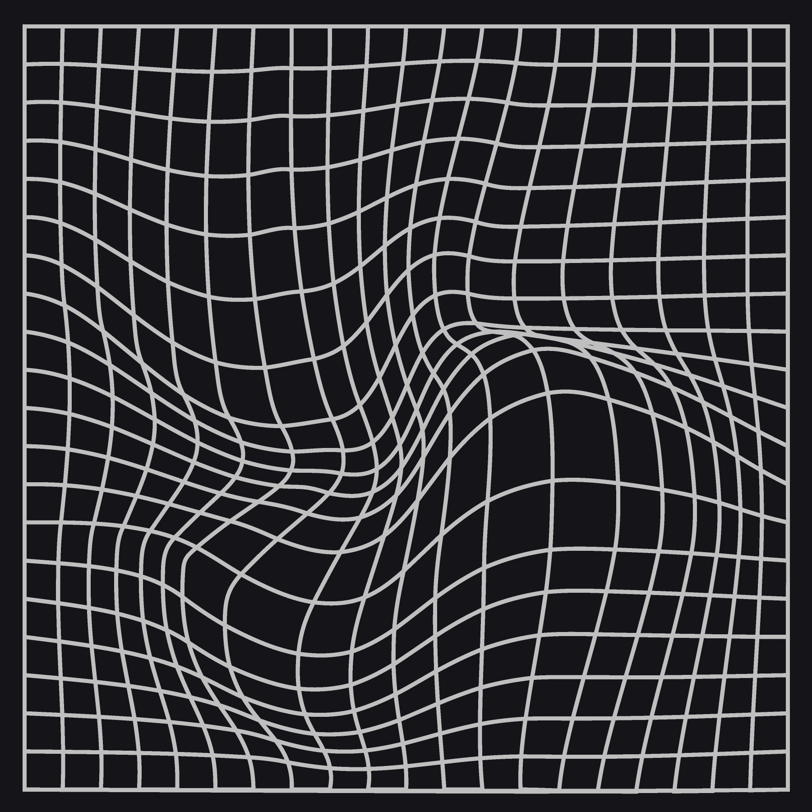

<a id="readme-top"></a>

<br />
<div align="center">
  <a href="https://github.com/yassa9/SceneSynth">
    
  </a>

  <h1 align="center" style="font-size: 48px;">SceneSynth</h1>

  <p align="center">
    Blazing GUI for easily viewing and interacting with computer vision models.
    <br />

  </p>
</div>

<!-- ABOUT THE PROJECT -->
## About The Project

[![GIF shot][product-screenshot]](https://example.com)

SceneSynth is a software based on [imgui](https://github.com/ocornut/imgui) C++ library, where it takes new computer vision models along with interacting and utilizing in easiest way by a super fast gui.  

You just choose your target image, choose which job you want to execute from detection, classification or segmentation, to pose and depth estimation, then simply press run, and you got your output with all necessary information, avoiding much python copy & paste lines of code.

<p align="right">(<a href="#readme-top">Back Top</a>)</p>

### Built With

This section should list any major frameworks/libraries used to bootstrap your project. Leave any add-ons/plugins for the acknowledgements section. Here are a few examples.

* [![ImGui][imgui]][imgui-url]
* [![C++][cpp]][cpp-url]
* [![C][c]][c-url]
* [![Python][python]][python-url]
* [![openCV][opencv]][opencv-url]
* [![Libtorch][libtorch]][libtorch-url]

<p align="right">(<a href="#readme-top">Back Top</a>)</p>

<!-- GETTING STARTED -->
## Getting Started

Follow these instructions to set up your project locally.

### Prerequisites

Ensure you have Python installed. You can download it from [python.org](https://www.python.org/).

### Installation

1. Clone the repository
   ```sh
   git clone https://github.com/yassa9/SceneSynth.git
   cd SceneSynth
   ```
2. ```py
   pip install ultralytics opencv-python transformers torch numpy pillow
   ```
3. Ensure you have `make` installed. On macOS and Linux, make is usually pre-installed. On Windows, you might need to install a tool like `MinGW` to get `make`.

### Building the Project

  To build the project, navigate to the `src` directory and run `make`.
   ```sh
   cd src
   ```
   ```sh
   make && ./SceneSynth
   ```
<!-- ROADMAP -->
## Roadmap

- [x] Support Pose and Depth Estimation
- [ ] Support Windows & Mac, now only Linux
- [ ] Easily add other Hugging Face models
- [ ] Apply model on many photos at one time
- [ ] Support Video models


See the [open issues](https://github.com/yassa9/SceneSynth/issues) for a full list of proposed features.

<p align="right">(<a href="#readme-top">Back Top</a>)</p>


<!-- MARKDOWN LINKS & IMAGES -->
[product-screenshot]: images/gifshot.gif

[imgui]: https://img.shields.io/badge/imgui-20232A?style=for-the-badge&logo=imgui&logoColor=61DAFB
[imgui-url]: https://github.com/ocornut/imgui
[cpp]: https://img.shields.io/badge/c++-%2300599C.svg?style=for-the-badge&logo=c%2B%2B&logoColor=white
[cpp-url]: https://isocpp.org/
[c]: https://img.shields.io/badge/c-%2300599C.svg?style=for-the-badge&logo=c&logoColor=white
[c-url]: https://en.wikipedia.org/wiki/C_(programming_language)
[python]: https://img.shields.io/badge/python-3670A0?style=for-the-badge&logo=python&logoColor=ffdd54
[python-url]: https://www.python.org/
[opencv]: https://img.shields.io/badge/opencv-%23white.svg?style=for-the-badge&logo=opencv&logoColor=white
[opencv-url]: https://opencv.org/
[libtorch]: https://img.shields.io/badge/libtorch-%23EE4C2C.svg?style=for-the-badge&logo=PyTorch&logoColor=white
[libtorch-url]: https://pytorch.org/cppdocs/


